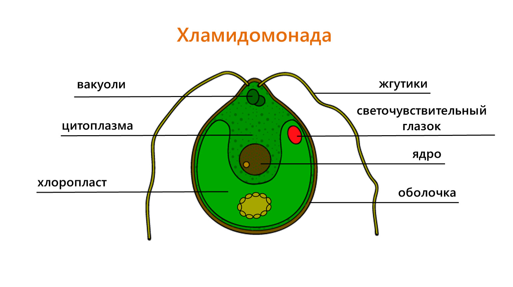

Лекция 7. Монады
================



Здесь мы будем рассматривать монады в духе книги [Душкина Р. В. «Функциональное
Программирование на языке Haskell»][1].

Общее понятие монады
--------------------

**Монада (в программировании)** — абстракция, позволяющая описать некоторое
последовательное вычисление. Монада представляет собой

* «значение, полученное определённым образом»,
* «значение, завёрнутое в некоторый контейнер»,
* «значение, получаемое с некоторым побочным эффектом».

Монада — параметризованный тип, будем, в соответствии с традициями Хаскеля,
обозначать его `M a`, где `M` символизирует некоторый тип-контейнер, а `a` —
типовый параметр, показывающий, что в нём хранится.

Один из знакомых вам примеров — монада `Option[T]` в Scala, аналогичная
монада в Хаскеле носит имя `Maybe a`. Эта монада представляет собой значение,
которое может отсутствовать.

В Хаскеле монада должна реализовывать четыре операции:

* `return :: a -> M a` — заворачивает значение в монаду,
* `>>= :: M a -> (a -> M b) -> M b` (читается «bind») — операция связывания,
  берёт значение типа `a`, завёрнутое в монаду и применяет к нему функцию,
  преобразующую значение типа `a` в завёрнутое в монаду значение типа `b`.
* `>> :: M a -> M b -> M b` — связывает два действия, если значение, хранящееся
  в монаде. Эта конструкция является синтаксическим сахаром:
  ```
  ma >> mb   ≡   ma >>= (\_ -> mb)
  ```
  Здесь `\_ -> mb` — это лямбда (безымянная функция), которая принимает
  аргумент, его игнорирует и возвращает `mb`.
* `fail :: M a` — она вызывается, например, при неудаче сопоставления
  с образцом
  в нотации `do`, может вызываться явно. В большинстве реализаций монад
  она прерывает программу с ошибкой, однако, для монад `Maybe` и `List`
  возвращается пустое значение.

Операции `return` и `>>=` позволяют только «завернуть» значение в монаду,
но при этом не предусмотрено средств для того, чтобы значение из монады «вынуть».

Если функция возвращает значение, завёрнутое в монаду, то это значит, данное
значение было получено по факту какой-то одной цепочкой вычислений.

Для ряда полезных монад, обычно, предусмотрены способы «выйти» из монады,
извлечь из неё значение. Но это частные случаи, и не все монады их обязаны
предоставлять. В частности, монада `IO` (ввода-вывода в Haskell’е) таких
средств не предоставляет (за исключением небезопасной `unsafePerformIO`),
так что если функция возвращает значение, завёрнутое в эту монаду, то его
можно или проигнорировать (и зачем вызывать такую функцию), или связать
с другими монадическими вычислениями и вернуть из самой функции. В этом
случае функция, вызвавшая функцию, возвращающую `IO`, тоже сама неизбежно
возвратит монаду `IO`. Таким образом, «грязные» функции ввода-вывода однозначно
помечаются типом возвращаемого значения — значение, завёрнутое в монаду
ввода-вывода.

Программа на Хаскеле начинает вычисление с функции
```haskell
main :: IO ()
```
Действия, которые будут «вплетены» в возвращаемое значение функции `main`,
программа и выполнит. В Хаскеле единичный тип (unit) обозначается пустым
кортежем `()`, т.е. `IO ()` означает функцию с побочным эффектом и без
возвращаемого значения (с возвращаемым значением единичного типа).

(Квадроточие в Хаскеле означает указание типа)

Примеры монад
-------------
Мы уже упомянули монады `Maybe` и `IO` Хаскеля. Рассмотрим подробнее монаду
`Maybe`.

### Монада `Maybe`

Тип `Maybe` определён в Хаскеле следующим образом:
```haskell
data Maybe a = Just a | Nothing
```
Монадические операции определены следующим образом:

```haskell
return :: a -> Maybe a
return x = Just x

(>>=) :: Maybe a -> (a -> Maybe b) -> Maybe b
(Just x) >>= f = f x
Nothing  >>= f = Nothing

fail :: Maybe a
fail = Nothing
```
Допустим, у нас есть несколько операций, каждая из которых может или породить
значение, или завершиться неудачей. Нам нужно вернуть результат, если все они
завершились успешно, либо сообщить об отсутствии результата, если хотя бы одна
из них завершилась неудачей. Для этого операции должны возвращать значение,
завёрнутое в `Maybe`, для получения результата будем использовать связывание
монад.

Допустим, эти операции — `f`, `g`, `h`, входные данные, `a`, `b`, `c`, функциям
`g` и `h` будут требоваться какие-то промежуточные результаты вычислений.

Рассмотрим реализацию без использования связывания монад:

```haskell
f :: A -> Maybe X
g :: B -> X -> Maybe Y
h :: C -> X -> Y -> Maybe Z

makeFGH :: A -> B -> C -> Maybe Z
makeFGH a b c =
  case (f a) of
    Just x -> case (g b x) of
                Just y -> h c x y
                Nothing -> Nothing
    Nothing -> Nothing
```

Очевидно, что приходится постоянно ветвиться — на каждом шаге проверять,
что значение есть, иначе передавать `Nothing`.

С использованием связывания монад запись получается короче:
```haskell
makeFGH :: A -> B -> C -> Maybe Z
makeFGH a b c =
  (f a) >>= (\x -> (g b x) >>= (\y -> (h c x y)))
```
Видно, что описывается лишь связь вычислений, а проверка на наличие или
отсутствие значения инкапсулируется внутри монады.

Для краткости в Хаскеле используется синтаксический сахар, так называемая
do-нотация:
```haskell
makeFGH :: A -> B -> C -> Maybe Z
makeFGH a b c =
  do x <- (f a)
     y <- (g b x)
     (h c x y)
```
do-нотация неявно преобразуется в вызовы операций `>>=` и `>>`.

Если перед `<-` располагается переменная, то синтаксический
сахар преобразуется по следующему правилу:
```
do var <- ma
   action1
   action2
   ...
↓ ↓ ↓
ma >>= \var -> do action1
                  action2
                  ...
```
В общем случае перед `<-` может располагаться образец,
тогда неявно вызывается операция `fail` в случае
неудачи сопоставления:
```
do pattern <- ma
   actions
   ...
↓
ma >>= \x -> case x of
               pattern -> do actions
                             ...
               _ -> fail
```
Если в do-нотации нет связывания, используется операция `>>`:
```
do action1
   action2
   ...
↓ ↓ ↓
action1 >> do action2
              ...
```

### Монада `State`
В чистом языке программирования результаты любой функции определяется
только значениями аргументов функции, функция не может взять ниоткуда,
кроме как из аргументов и не может никуда деть, кроме как отбросить
или возвратить. Поэтому, если концептуально алгоритм предполагает некоторое
общее глобальное состояние (например, методика рекурсивного спуска
подразумевает наличие глобальной переменной с текущим анализируемым символом),
это «глобальное состояние» приходится «протаскивать» через каждую функцию,
передавая его аргументом и возвращая его как один из результатов (несколько
результатов, очевидно, эмулируются как возврат одного кортежа из нескольких
значений).

Монада `State` позволяет инкапсулировать в себе передачу дополнительного
аргумента-состояния и возврат пары «содержательный результат» + «обновлённое
состояние».

Пример. У нас есть дерево, мы хотим все листья дерева пронумеровать
слева-направо, заменить значения в листьях на пары «номер»+«исходное значение».

```haskell
data Tree a = Leaf a | Node (Tree a) (Tree a)

enumTree :: Tree a -> Tree (Integer, a)
enumTree tree =
  let (tree', nextNum) = enumTreeRec tree 0 in
    tree'

enumTreeRec :: Tree a -> Integer -> (Tree (Integer, a), Integer)
enumTreeRec (Leaf x) num = (Leaf (num, x), num + 1)
enumTreeRec (Node t1 t2) n0 =
  let (t1', n1) = enumTreeRec t1 n0 in
    let (t2', n2) = enumTreeRec t2 n1 in
      (Node t1' t2', n2)
```
Здесь нам приходится «таскать» состояние, которое является счётчиком:
функция `enumTreeRec` принимает дополнительный параметр и возвращает
осмысленное значение и обновлённое состояние.

Функция `enumTreeRec`, как и все функции Хаскеля, каррированная,
принимает дерево и возвращает функцию, принимающую старое состояние
и возвращающую пару, содержащую актуальное значение и новое состояние.

Можно вот этот «хвост» `Integer -> (Tree (Integer, a), Integer)` «отрезать»
и инкапсулировать, говоря, что это на самом деле «дерево, вычисленное
в контексте, содержащем целое число».

В общем случае «значение `a` вычисленное в котексте `s`» имеет вид
```haskell
s -> (a, s)
```
и инкапсулируется в монаде `State s a`. Eсли сравнить с обозначением `M a`
из начала лекции, то здесь `M` это `State s` — контекст со значением
типа `s`. Параметр `a` может в ходе вычислений меняться, параметр `s`
остаётся при связывании неизменным.

Монада `State` определяется примерно так:

```haskell
data State s a = State s -> (a, s)

return :: a -> State s a
return x = State (\s -> (x, s))

(>>=) :: State s a -> (a -> State s b) -> State s b
(State sf) >>= f  =
  let sh = \s -> (let (a, s') = sf s in
                    let (State sg) = f a in
                      sg s') in
    State sh
```
Тип
```haskell
(>>=) :: State s a -> (a -> State s b) -> State s b
```
можно условно понять как
```haskell
(>>=) :: (s -> (a, s)) -> (a -> (s -> (b, s))) -> (s -> (b, s))
```
Если убрать скобки (вспоминаем, что функции в Хаскеле всегда каррированные,
а операция `->` правоассоциативна), то получим такой тип:
```haskell
(>>=) :: (s -> (a, s)) -> (a -> s -> (b, s)) -> s -> (b, s)
```
Функция связывания принимает значение `a`, вычисляемое в контексте `s` —
функцию, принимающую контекст и вычисляющую пару из значения и нового контекста,
затем принимает функцию, ожидающую значение типа `a` и контекст `s`,
и возвращающую пару из значения типа `b` и нового контекста, затем принимает
сам начальный контекст и возвращает пару из `b` и `s`.

Для доступа к состоянию используются функции `get` и `put`:

```haskell
get :: State s s
get = State (\s -> (s, s))

put :: s -> State s ()
put s = State \_ -> ((), s)
```
Для возврата значения из монады используется функция `runState`:

```haskell
runState :: State s a -> s -> (a, s)
runState (State f) s = f s
```
Используя эта-конверсию, функцию можно упростить:
```haskell
runState :: State s a -> s -> (a, s)
runState State f = f
```
Функцию нумерации деревьев теперь можно описать так:
```haskell
data Tree a = Leaf a | Node (Tree a) (Tree a)

enumTree :: Tree a -> Tree (Integer, a)
enumTree tree =
  let (tree', nextNum) = runState (enumTreeRec tree) 0 in
    tree'

enumTreeRec :: Tree a -> State Integer (Tree (Integer, a))
enumTreeRec Leaf x =
  do num <- get
     put (num + 1)
     return (Leaf (num, x))
enumTreeRec (Node t1 t2) n0 =
  do t1' <- enumTreeRec t1
     t2' <- enumTreeRec t2
     return (Node t1' t2')
```

Монады `Reader`, `Writer` и `Cont` — для самостоятельного изучения.

Монада `IO`
-----------
В этом разделе мы рассмотрим _модель_ ввода-вывода в чистом языке
программирования. Это модель, т.к. в реальных компиляторах Haskell’я
монада `IO` может быть реализована и иначе. Однако, модель позволяет
лучше понять идею монад.

Каким образом мы можем изобразить (промоделировать) цепочку операций
ввода-вывода в чистом языке? Для простоты будем считать, что ввод и вывод
ограничены одиночными символами.

Вывод моделируется просто: вернуть `Char` и продолжение цепочки вычислений.
Ввод уже хитрее: мы должны вернуть функцию, принимающую вводимый `Char`
и возвращающую продолжение этой цепочки. Т.е. чистое значение, образованное
из этих конструкций, взаимодействует с неким «грязным» интерпретатором,
выполняющим то ввод, то вывод.

Цепочку вычислений можно изобразить так:

```haskell
data IOTerm = PutChar Char IOTerm
            | GetChar (Char->IOTerm)
            | Exit
```
Третья ветка `Exit` служит для завершения цепочки операций ввода-вывода.

Чистая программа должна формировать это значение `IOTerm`, одну сплошную
цепочку, завершающуюся `Exit`’ом на конце. Но каким образом тогда программу
разбивать на отдельные этапы, на отдельные функции? Функции должны будут
возвращать какой-то «кусок» этой цепочки. Тогда как этот «кусок» представить?

«Кусок» — это цепочка с дыркой на конце. Т.е. функции, которые выполняют
ввод-вывод, должны дополнительным параметром принимать продолжение этой
цепочки, и эту цепочку они должны будут дописывать в конец. Рассмотрим
первую попытку:

```haskell
putChar1 :: Char -> IOTerm -> IOTerm
putChar1 ch cont = PutChar ch cont

putString1 :: [Char] -> IOTerm -> IOTerm
putString1 (x:xs) cont = PutChar x (putString1 xs cont)
putString1 [] cont = PutChar '\n' cont
```

Для вывода это работать будет. Но для ввода это работать не будет: если мы
будем принимать фиксированное продолжение `cont` и оборачивать его в лямбду
`\ch -> cont`, то мы никак не сможем учитывать само введённое значение.

Значит, для ввода нам нужно принимать не константное продолжение, а функцию,
которая принимает введённый символ и возвращает продолжение:

```haskell
getChar1 :: (Char -> IOTerm) -> IOTerm
getChar1 k = GetChar \ch -> (k ch)

getString1 :: ([Char] -> IOTerm) -> IOTerm
getString1 k = GetChar \ch ->
  case ch of
    '\n' -> k []
    ch   -> getString1 (\str -> k (ch : str))
```

Для единообразия в этом же духе можно переписать и функцию чтения, в этом
случае мы будем получать не продолжение, а функцию, которая принимает _что-то_
и возвращает продолжение:

```haskell
putChar2 :: Char -> (() -> IOTerm) -> IOTerm
putChar2 ch k = PutChar ch (k ())

putString1 :: [Char] -> (() -> IOTerm) -> IOTerm
putString1 (x:xs) k = PutChar x (putString1 xs k)
putString1 [] k = PutChar '\n' k
```

Видим общий паттерн: функции возвращают значение типа `(a -> IOTerm) -> IOTerm`.
Это ни что иное, как монада `Cont`. Поэтому связывание вычислений можно
организовать также, как и в монаде `Cont`.

Полный пример можно скачать [по ссылке](myIO.hs).


[1]: https://www.researchgate.net/publication/315642004_Functional_Programming_with_Haskell_Language
